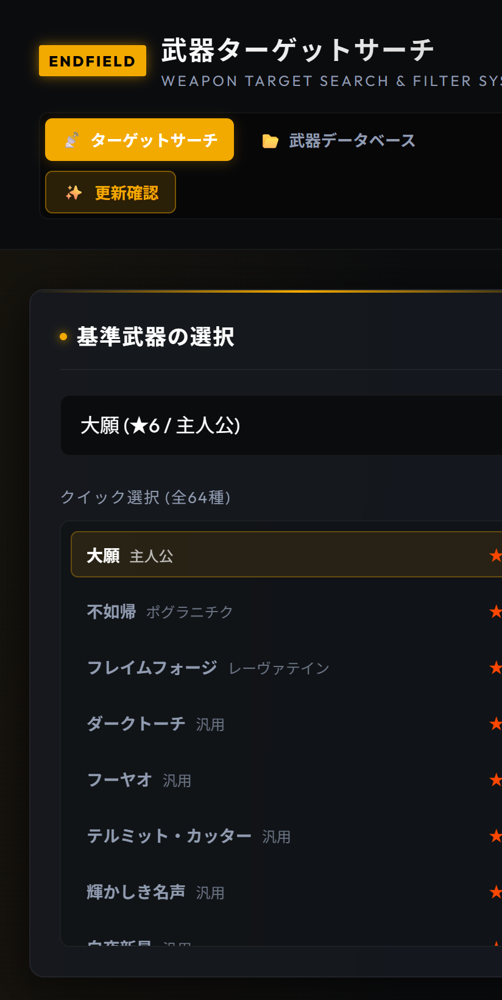
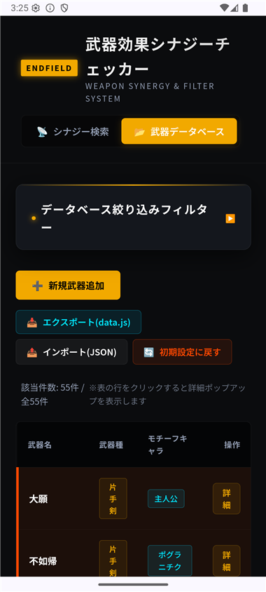
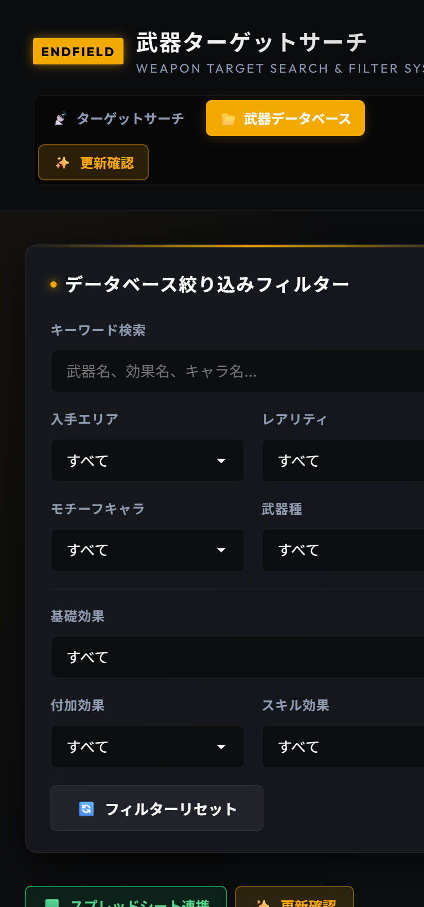
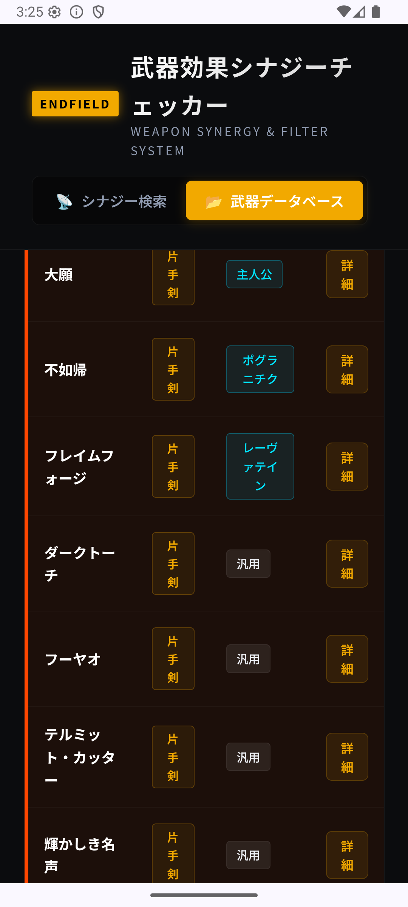
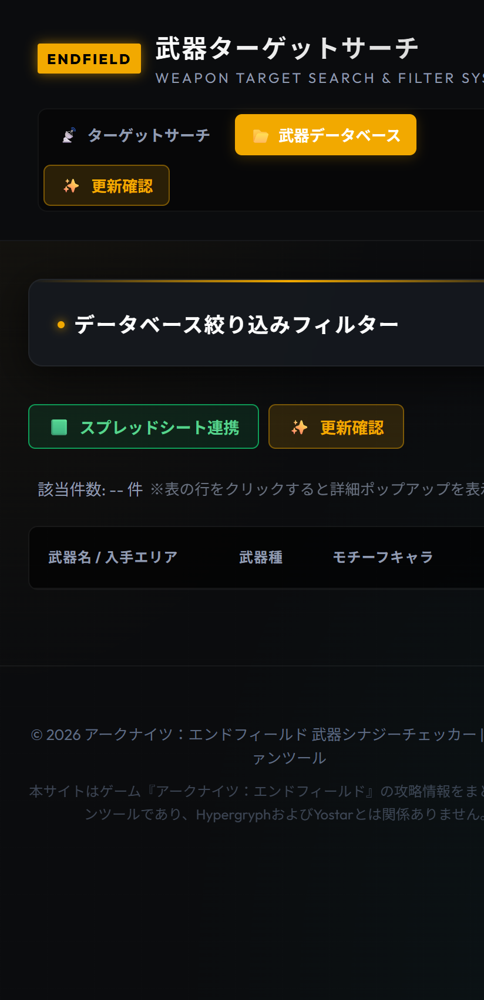
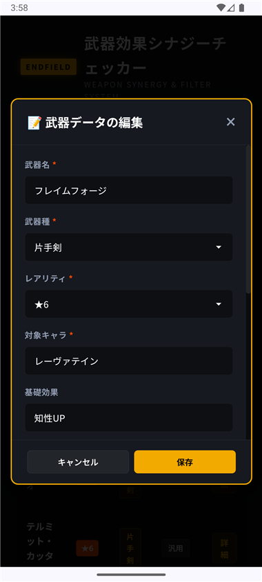

# 『アークナイツ：エンドフィールド』武器シナジー＆フィルターツール 機能仕様書

本仕様書は、ローカルで構築されたHTML5/CSS3/JavaScriptによる「武器シナジー＆フィルターツール」およびそれを内包する「Androidネイティブアプリ」の機能・デザイン・データ構造における現在の仕様をまとめたものです。

---

## 1. アプリケーション概要
本アプリは、3Dリアルタイム戦略RPG『アークナイツ：エンドフィールド（タロII）』のゲームシステムを想定した非公式ファンツールです。
各武器が持つバフ効果（基礎効果・付加効果・スキル効果）のドロップエリア内での重複（シナジー）を解析し、最適なフィルター設定を提案する「**ターゲットサーチ**」と、全武器データを一元管理・編集できる「**武器データベース**」の2つの主要機能を提供します。
UI/UXデザインは、ゲーム公式ウェブサイト of ブランドカラー（アンバーイエローとネオンシアンを基調としたSF近未来HUDスタイル）を再現しています。

---

## 2. 技術スタック
*   **Androidネイティブアウター**:
    *   **言語/フレームワーク**: Kotlin / Jetpack Compose
    *   **ビューアー**: `AndroidView` による WebView レンダリング
    *   **アセット読み込み**: `WebViewAssetLoader` を使用し、ローカルの `assets` 内リソースをHTTPSコンテキスト（`https://appassets.androidplatform.net/assets/index.html`）で安全に読み込み
    *   **画面設定**: 縦画面固定（`screenOrientation="portrait"`）
*   **Webアプリケーション（コア）**:
    *   **マークアップ/スタイル**: HTML5 / Vanilla CSS3（Google Fonts: Outfit, Noto Sans JP）
    *   **ロジック**: Vanilla JavaScript (ES6)
    *   **永続化**: `localStorage` を使用したユーザーカスタム武器データのローカル保存

---

## 3. 画面構成と機能仕様

### 3.1 共通ヘッダー（HUDデザイン）
*   **デザイン**: 不透明なマットブラック背景（`#0b0c0e`）、1pxの境界線。スクロール時も画面上部に固定（`position: sticky`）され、背景コンテンツが透けないように遮断（`z-index: 1000`）。
*   **表示要素**: 
    *   「Endfield」のアンバーゴールド発光バッジ
    *   アプリタイトル（「武器ターゲットサーチ＆フィルターシステム」）
    *   ナビゲーションタブ（「ターゲットサーチ」「武器データベース」）

---

### 3.2 「ターゲットサーチ」タブ（旧「シナジー検索」）
選択した「基準武器」とドロップエリアが重なり、かつ各種効果が一致する他の武器を効率的に同時収集するための画面です。

*   **基準武器の選択**:
    *   **ドロップダウンセレクト**: 武器種ごとにグループ分け（`optgroup`）されたリストから基準武器を選択可能。
    *   **クイック選択リスト（左カラム）**: 登録されている全武器（53種）を一覧で縦スクロール表示。タップすることで瞬時に基準武器を切り替え可能。
*   **基準武器カード表示**:
    *   選択された武器の名前、レアリティ（★5/★6）、モチーフキャラ、武器種、および効果テキスト（基礎、付加、スキル）をカード形式で表示。
*   **ドロップフィルター推奨設定（オプティマイザー）**:
    *   ゲーム内のドロップ仕様（基礎効果から3種、付加/スキルから1種をフィルター選択可能）に基づき、同じエリアでドロップする他武器（シナジー武器）を最も多く同時収集できる設定を自動算出・提案します。
    *   **基礎効果 (3スロット)**: 基準武器の基礎効果を必須枠（オレンジ色のバッジ）とし、残りの2スロットは同時収集可能な他武器が持つ基礎効果の重複が多い順に自動アサイン（灰色のバッジ）。
        *   ※v1.0.1改修: メイン武器以外の基礎効果バッジから `(ダミー)` というテキスト表記を削除（斜体・グレーアウトのダミースタイルは維持）。
    *   **付加/スキル (1スロット)**: 基準武器が持つ付加効果とスキル効果のうち、同エリアの他武器と最も重複（シナジー）が多い効果を自動で1つ選択。
        *   基準武器が対象の効果を持たない場合は `効果なし` と表示します。
        *   ※v1.0.1改修: `効果なし (ダミー)` というテキスト表記から `(ダミー)` を削除し `効果なし` に統一。
    
    #### [イメージ画像：ターゲットサーチ＆推奨ドロップフィルター設定]
    

*   **この組み合わせで一緒に狙える武器（右カラム）**:
    *   基準武器の入手可能エリアごとにコンテナ（📍マーク）を生成。
    *   推奨ドロップフィルター設定を満たし、そのエリアで実際に出現する適合武器のみを抽出してリスト表示（非適合 of ノイズ武器を排除）。
    *   リストは以下の2つのセクションに分けてすっきりと表示されます。
        1.  **🎯 本命ターゲット**: 選択中の基準武器。
        2.  **📦 この組み合わせで一緒に狙える武器**: フィルターに合致して同時収集できる他の武器。一致する効果（基礎、付加、スキル）の内訳も表示。
    *   一致する他武器の行をタップすると、その武器を新たな基準武器として瞬時に再検索可能。
    
    #### [イメージ画像：一緒に狙える武器のリスト表示]
    

---

### 3.3 「武器データベース」タブ
登録されている武器データを表形式で閲覧・検索でき、データのインポート/エクスポートや追加・編集の起点となるタブです。

*   **データベース絞り込みフィルター（アコーディオン式）**:
    *   **初期状態**: 画面占有を避けるため、初期ロード時は**折りたたまれた（閉じた）状態**で表示。
    *   **開閉トリガー**: 「データベース絞り込みフィルター 🔽」ヘッダー部分をタップすることで、滑らかなスライドアニメーションで開閉。閉じた状態では矢印が横を向き、開くと下を向く。
    *   **フィルター項目**:
        1.  キーワード検索（武器名、モチーフキャラ、武器種、各種効果の部分一致）
        2.  入手エリア、レアリティ、モチーフキャラ、武器種、各種効果（基礎・付加・スキル）のセレクトボックス。
    *   **フィルターリセット**: 「🔄 フィルターリセット」ボタンで、すべての入力値とセレクトボックスをクリアし全件表示に戻す。
    
    #### [イメージ画像：フィルターの開閉動作]
    | 閉じた状態（初期） | 展開した状態 |
    | :---: | :---: |
    |  |  |

*   **データベースコントロール（上部ボタン群）**:
    *   **新規武器追加**: タップで「武器データの追加」モーダルを起動。
    *   **Googleスプレッドシート連携**: スプレッドシートURLを設定してリアルタイム同期を行うモーダルを起動。
    *   **CSV出力 / CSV取り込み**: Excelや各種表計算アプリで直接編集できる UTF-8 BOM 付き CSV での保存・インポート。
    *   **JS出力 / JSON取込**: `data.js` または JSON 形式でのデータエクスポート・インポート。
    *   **初期設定に戻す**: `localStorage` をクリアし、初期データ53種にリセット。
*   **データベーステーブル**:
    *   **表示列**: 「武器名」「武器種」「モチーフキャラ」「操作（詳細）」の4列構成とし、モバイル縦画面での横スクロールを排除。
    *   **レアリティ背景色分け**: 「レアリティ」列を廃止し、行（`<tr>`）の背景色と左端ボーダーで判別。
        *   **★6武器の行**: 背景色 `rgba(255, 71, 0, 0.08)` / 左端ボーダー `4px solid #ff4700`
        *   **★5武器の行**: 背景色 `rgba(242, 169, 0, 0.06)` / 左端ボーダー `4px solid #d29600`
        *   テーブル全体の端から端（右端）まで、均一な半透明の背景色で塗られます。
    *   **武器種の略称**: テーブル一覧表示内に限り、「アーツユニット」を「**アーツ**」と省略表記して省スペース化。他画面（モーダルやフィルター等）では正式名称「アーツユニット」を維持。
    
    #### [イメージ画像：データベーステーブル（レアリティ背景色分け・アーツ略称）]
    

---

### 3.4 モーダル（ダイアログ）仕様
スマートフォンの縦画面向けに、ヘッダーとフッター（保存・キャンセル・操作ボタンなど）を画面上下に固定し、入力フォームや情報一覧が配置された中央ボディ部のみが独立スクロールする構成。

*   **Googleスプレッドシート連携モーダル**:
    *   Googleスプレッドシートで編集・追加したデータをアプリへダイレクトに読み込む設定モーダル。
    *   **スマートURL変換**: スプレッドシートの閲覧共有URL（`https://docs.google.com/spreadsheets/d/.../edit`）を貼り付けるだけで、CSVデータ取得エンドポイントへ自動変換。
    *   **アプリ起動時自動同期**: チェックボックスをオンにすると、アプリ起動時に登録したスプレッドシートからバックグラウンドで最新データを自動取得して反映。
    *   **ワンタップ即時同期**: 「今すぐ同期」ボタンで手動更新。同期成功/失敗のステータスログを表示。
    *   **テンプレートCSV保存**: スプレッドシートへアップロードして編集を開始できる初期データ入りテンプレートCSVのダウンロードボタンを配置。

*   **武器詳細情報モーダル**:
    *   武器のすべての情報（効果詳細、全ドロップエリア等）をカードリスト形式で表示。
    *   下部アクションフッターに「削除する」「編集する」「ターゲットサーチ」の3つのコントロールを配置。
    
    #### [イメージ画像：武器詳細情報モーダル]
    

*   **武器データの追加・編集モーダル**:
    *   武器の追加または既存データの編集を行うフォーム。
    *   **入力フォーム項目**: 武器名（必須）、武器種、レアリティ、モチーフキャラ、各種効果（基礎・付加・スキル）、ドロップエリア（複数選択のチェックボックス）、新規エリアの追加。
    *   **ドロップエリアの表示順仕様**:
        *   データ登録状況に関わらず、指定された順序で常にすべて表示。
        *   標準ソート順: `中枢エリア -> 原石研究パーク -> 鉱山エリア -> エネルギー高地 -> 武陵城 -> 清波砦 -> 首礎 -> 実験区域`
        *   新規追加されたカスタムエリアは、標準エリアの後ろにソートされて追加。
    
    #### [イメージ画像：武器データの編集モーダル（ドロップエリアソート）]
    

*   **アプリのアップデートモーダル**:
    *   外部 `update.json` や GitHub Release を参照し、アプリ内から新バージョンのAPKを直接ダウンロード＆インストールするダイアログ。
    *   **リアルタイムダウンロード進捗表示**: %表記（`0%`～`100%`）、グラデーションプログレスバー、およびダウンロード済みファイル容量（`MB / MB`）をリアルタイム更新表示。
    *   **開発・テスト用「強制再インストール」対応**: 手動更新確認時、同じバージョン番号（Code）であっても「⚡ 強制再インストール」ボタンが表示され、バージョン変更なしで最新ビルドのAPKを直接上書きインストール可能。
    *   **詳細エラー通知**: 404エラー（URL不正・リポジトリ非公開）や通信失敗時、ダイアログおよびトーストで具体原因（例: HTTP 404）を表示。

---

## 4. データ仕様と永続化

### 4.1 初期データ (`data.js`)
*   アプリの初期データとして、★6および★5の武器データ計53種が定義されています。
*   エリア名の表記揺れを統一（「清破砦」を「**清波砦**」に統一）。

### 4.2 ローカル永続化（`localStorage`）
*   `ENDFIELD_WEAPONS_CUSTOM`: ユーザーがカスタマイズ・追加・インポートした全武器データ（JSON文字列）。
*   `ENDFIELD_GSHEET_URL`: 登録されたGoogleスプレッドシートの共有URL。
*   `ENDFIELD_GSHEET_AUTOSYNC`: アプリ起動時の自動同期の有効化フラグ（`true` / `false`）。

---

## 5. アセットおよびアプリアイコンの管理

### 5.1 アプリアイコン仕様
*   **ベースデザイン**: ダークメタリックのスクエアを背景に、ネオンに光るアンバーゴールドの山形（シェブロン）と幾何学的なHUD武器照準デザインを配したプレミアムゲームランチャー調のアイコン。
*   **互換性担保**: Android 8.0以上でXML定義が優先されてしまうのを防ぐため、`mipmap-anydpi-v26`（アダプティブアイコン用XML）およびデフォルトの `webp` アイコンを削除し、PNGアイコンが直接表示されるように最適化。

    #### [イメージ画像：生成されたアプリアイコンとホーム画面での表示]
    | アプリ用アイコン（ベース） | ホーム画面での表示イメージ |
    | :---: | :---: |
    |  |  |

### 5.2 アセット自動配置スクリプト
*   [resize_icons.ps1](file:///C:/Users/yf-02/.gemini/antigravity/scratch/endfield-android-app/resize_icons.ps1):
    ベース画像から各 mipmap フォルダへのリサイズ配置、アダプティブアイコンの削除、および競合 `webp` ファイルの一括削除を自動化する PowerShell スクリプト。

### 5.3 CI/CD および自動配信パイプライン仕様
*   **GitHub Actions ワークフロー** ([.github/workflows/build-release.yml](file:///C:/Users/yf-02/.gemini/antigravity/scratch/endfield-android-app/.github/workflows/build-release.yml)):
    *   プッシュ（`v*` タグ、`main` / `1.0.*` ブランチ）をトリガーとして、クラウド上の Ubuntu + JDK 17 環境で `./gradlew assembleDebug` を全自動実行。
    *   ビルド成功後、GitHub Releases の `latest` タグへ生成された `endfield-weapon-filter-debug.apk` を自動アタッチし、恒久固定URL (`https://github.com/halver/endfield-weapon-filter/releases/download/latest/endfield-weapon-filter-debug.apk`) として全自動公開配信。
*   **Google Drive 同期スクリプト** ([build_and_upload.ps1](file:///C:/Users/yf-02/.gemini/antigravity/scratch/endfield-android-app/build_and_upload.ps1)):
    *   PowerShell環境においてワンコマンドで「自動ビルド ➔ Google Drive for Desktop (マイドライブ) への自動コピー」を一括実行するローカル同期用スクリプト。

---

## 6. 改訂履歴

### v1.0.3
*   **リアルタイムダウンロード進捗表示（% / プログレスバー / MB容量表示）**:
    *   アプリアップデート実行中に、パーセント（`%`）、グラデーションプログレスバー、およびダウンロード済み容量（`MB / MB`）をリアルタイムで視覚表示する機能を実装。
*   **開発・テスト用「強制再インストール」機能**:
    *   手動更新確認時、バージョン番号を変更することなく最新ビルドのAPKを即座に上書きダウンロード・再インストールできる開発補助機能を実装。
*   **詳細な通信エラーハンドリング（404通知等）**:
    *   URL不正や非公開リポジトリによるダウンロード失敗時に `HTTP 404` 等の具体的エラー理由をダイアログ・トースト表示する機能を追加。
*   **Android Native File Saver (`saveFile`)**:
    *   Android実機上で「CSV出力」等を行った際、端末標準の「Download (ダウンロード)」フォルダへファイルを直接保存・通知するネイティブ連携処理を実装。
*   **GitHub Actions CI/CD パイプラインの構築**:
    *   Gitプッシュ時にクラウド上で自動ビルドを行い、GitHub Releases 経由で固定公開URLへ自動配信するワークフローを追加。
*   **Google Drive 自動同期スクリプト (`build_and_upload.ps1`)**:
    *   ビルドからパソコン版 Google ドライブへのコピーまでを一括全自動化するPowerShellスクリプトを追加。

### v1.0.2
*   **Googleスプレッドシート直接編集・リアルタイム同期機能**:
    *   Googleスプレッドシート上で直接編集・追加した武器データを、アプリへワンタップまたはアプリ起動時に自動同期する機能を実装。
    *   普通の共有URL（`/edit`）をデータ取得用URL（`/export?format=csv`）に自動変換するスマートURL変換エンジンを搭載。
    *   連携モーダル内にセットアップガイドおよびテンプレートCSVダウンロード機能を配置。
*   **CSV形式（UTF-8 BOM付き）のインポート/エクスポート**:
    *   Excelでの日本語文字化けを防ぐ UTF-8 BOM 付き CSV エクスポートに対応。
    *   日本語および英語のヘッダー名に両対応した柔軟なCSVパーサーを搭載。複数エリアのセミコロン区切り `;` に対応。
*   **アプリ内セルフアップデート機能（Android）**:
    *   外部 `update.json` を参照し、アプリ内から新バージョンの検出・APKの直接ダウンロードとインストールを実行可能。

### v1.0.1
*   **「ターゲットサーチ」への改称と最適化**:
    *   従来の「シナジー検索」から、より機能が直感的に伝わる「ターゲットサーチ」へ表記を一貫して改称。
    *   モバイル縦画面において、ナビゲーションタブの「ターゲットサーチ」の文字が折り返されないようにスタイル（`white-space: nowrap` と余白調整）を最適化。
*   **推奨ドロップフィルター表示のクリーンアップ**:
    *   推奨ドロップフィルター設定に表示されるバッジから、余計な `(ダミー)` というテキスト表記をすべて削除。
    *   本命以外の基礎効果バッジは「(ダミー)テキスト」を廃止し、デザイン（斜体・薄色）のみで視覚的に区別する形に整理。
    *   効果なし時の表示を `効果なし (ダミー)` から `効果なし` に変更。
*   **ゲーム仕様への論理適合と表記修正**:
    *   推奨設定で一緒に出現する武器のラベルを「この組み合わせで一緒に狙える武器」へ表記統一。
